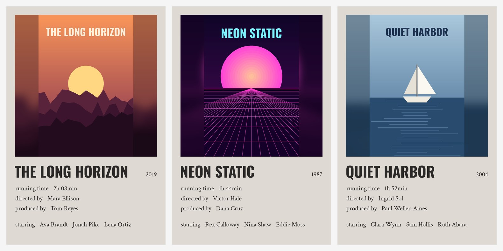
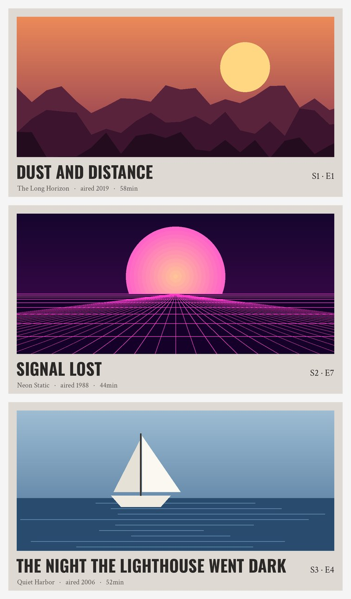

# Plex Polaroid Posters

Gives every movie and TV show in your Plex library a matching minimalist "polaroid" style poster: the poster in a square frame on an off-white background, with the title and year in bold lettering underneath, then the details and top three stars.

- **Movies** show running time, director and producer.
- **TV shows** show network, number of seasons and number of episodes.
- **Episodes** (optional) get a wide thumbnail in the same style: the episode's own screenshot, the episode title in bold, season and episode number, the show, the year it aired and its running time.
- **Each season** of a show gets its own poster too, with its season number, the year it aired and its episode count. Seasons use their own artwork when Plex has it, and the show's poster otherwise.



*Example posters (made-up movies, for illustration).*



*Example episode thumbnails, the optional wide layout for episodes (made-up shows).*

All the info comes from Plex automatically. Your original posters are backed up first, and you can put them back at any time.

## What you need

- A Windows PC that can reach your Plex server (the same PC is easiest)
- Python 3, free from [python.org](https://www.python.org/downloads/)
- Your Plex token (see below)
- To be signed in as the Plex account that **owns** the server

## Setup (one time)

1. **Download this repo.** Click the green **Code** button, then **Download ZIP**, and unzip it somewhere simple like `C:\PlexPolaroidPosters`. Avoid Documents, Desktop or OneDrive, because Windows can block the tool from saving files there.
2. **Install Python.** On the first screen of the installer, tick **"Add python.exe to PATH"** before clicking Install.
3. **Find your Plex token.** Open Plex in a web browser and go to any movie. Click **⋯ → Get Info → View XML**. In the new tab's address bar, copy everything after `X-Plex-Token=` (about 20 letters and numbers, stopping before any `&`). Keep it private, because it works like a password to your Plex server.
4. **Double-click `install.bat`** and wait for "All set".

## Using it

Double-click `run.bat`. The first time, it asks for:

- **Your Plex server address.** Press Enter if Plex runs on this PC. Otherwise use the server's local IP, e.g. `http://192.168.1.50:32400` (Plex shows it under Settings → Remote Access).
- **Your Plex token.**
- **Your movie library's name**, exactly as it appears in Plex.
- **Your TV library's name**. Press Enter for "TV Shows", or type `none` to only do movies.
- **Whether to do episodes too.** Type `Y` for yes. The first run can take hours on a big TV library, but it resumes where it left off if interrupted. You can change this later with option 5.

Then pick from the menu:

| Option | What it does |
|---|---|
| **1. Preview 10 posters per library** | Makes 10 samples from each library (plus the seasons of those shows, and two episodes per season if episodes are on) in `polaroid_preview` and opens the folder. Nothing in Plex changes. Do this first. |
| **2. Apply to library** | Does every movie and show. Anything already done is skipped, so run it again after adding new ones or if a run gets interrupted. Show and season posters whose season or episode counts have changed are refreshed automatically. |
| **3. Redo everything** | Same as 2, but redoes finished ones too. A redo remembers its progress, so if it gets interrupted you can continue it instead of starting over. |
| **4. Restore original posters** | Puts every original poster back from the backups. |
| **5. Change settings** | Re-enter your address, token or library names. |
| **7. Continue unfinished redo** | Only appears if a redo was interrupted. Picks up where it stopped, with the same libraries and options, even if the redo was started from the command line. |
| **8. Nightly automatic run** | Sets up a Windows scheduled task that runs option 2 every night at a time you pick, so anything new you add to Plex gets its poster without you doing anything. Choose 8 again to change the time, turn it off, or open the log of the last run (`last_scheduled_run.log`). The PC needs to be on; if it was off or asleep, it runs as soon as it can. |

## Good to know

- Original posters are saved in `poster_backups`. Keep this folder if you might ever want to restore them.
- Finished movies, shows and seasons get a Plex label called `polaroid`, which is how the tool knows what's done. Option 4 removes it. (On older Plex servers that can't label seasons, finished seasons are tracked in `poster_backups` instead.) Finished episodes are always tracked in `poster_backups`, which is much faster for big libraries.
- New posters are locked so Plex doesn't swap them back on its own.
- When you add new seasons or episodes to a show, option 2 makes posters for the new ones and also refreshes that show's poster (and the season's) so the counts stay correct. The counts each poster was made with are remembered in `poster_backups`.
- `settings.bat` holds your token. It's excluded from git by `.gitignore`, but don't share it.
- The fonts (Oswald and Crimson Text, both under the SIL Open Font License) download automatically from Google Fonts on first run.

## Troubleshooting

| Problem | Fix |
|---|---|
| `py is not recognized` / "Python wasn't found" | Reinstall Python and tick "Add python.exe to PATH". |
| `401 Unauthorized` | The token is wrong or out of date. Get a fresh one, then use option 5. Make sure you're signed in as the server owner. |
| `Access is denied` / `PermissionError` | Move the folder to `C:\PlexPolaroidPosters`. |
| Can't find a library | The tool lists your actual library names. Use option 5 and type one exactly as shown. |
| Timeouts / "Plex didn't answer" | Plex is busy. The tool waits and retries on its own. Run option 2 again at the end to pick up any that failed. |
| Some items say "failed" | The run ends with a list of what failed and why, also saved to `failed_items.log` in the folder. Items Plex has no usable artwork for (missing files, broken thumbnails) are skipped instead of failing. |
| Can't connect at all | Check the address. If Plex is on another computer, use its IP instead of `localhost`. |

## Mac / Linux / command line

```bash
python3 -m pip install -r requirements.txt
python3 plex_polaroid.py --url http://localhost:32400 --token YOURTOKEN --dry-run --limit 10
```

Drop `--dry-run --limit 10` to apply it for real. Other options:

| Option | Meaning |
|---|---|
| `--library "Name"` | Library to use (default: Movies). Repeat it to do several, e.g. `--library Movies --library "TV Shows"` |
| `--force` | Redo ones that are already done. If a redo is interrupted, running the same command again picks up where it stopped |
| `--continue` | Continue an unfinished redo with the libraries and options it was started with |
| `--fresh` | With `--force`: forget an unfinished redo and start over |
| `--restore` | Put the original posters back |
| `--only "Title"` | Only movies/shows whose title contains this text |
| `--episodes` | Also do every episode's thumbnail |
| `--no-seasons` | Only do the main show posters, not each season |
| `--use-still` | Use a cropped scene from the movie instead of the poster (experimental; can cut off people) |
